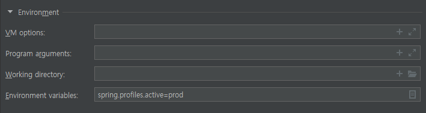

# Spring Boot 환경 나누기
## 1. 설정 구분
 기본적으로 Spring 프로젝트를 생성해보면 application.properties가 존재하고 실행 될때 application.properties를 먼저 불러들인다.
#### 1. 기본 포맷 파일이름(Properties)으로 구분
 - 각각 환경별로 application-(환경이름).properties 라는 포맷으로 파일을 생성해둔다.
> 참고 - Properties 파일을 불러들이는 순서
> 1. A /config subdir of the current directory.
> 2. The current directory
> 3. A classpath /config package
> 4. The classpath root
 - Profile이 dev로 지정될 경우 application-dev.properties를 로드하게 된다.
#### 2. Custom한 파일이름으로 구분
 - 먼저 자기 맘대로 properties 파일을 만들어보자 (asdf.properties, asdf2.properties)
 - 그 다음 이를 불러들이기 위한 Configuration 클래스를 작성한다.
    ```java
    @Configuration
    @Profile("환경이름")
    @PropertySource(value="classpath:asdf.properties")
    public class ConfigClass {
    }
    ```
 - PropertySources 어노테이션을 이용하면 많은 파일을 한꺼번에 분리해둘 수 있다.
 - 필요에 따라 @Import 해서 사용할 수 있다.
## 2. Profile 지정
 1. jar, war 파일 실행시 java envrionment에 spring.profiles.active=(환경이름) 지정
> java -jar -Dspring.profiles.active=(환경이름) xxx.jar

  
    
IntelliJ 사용 중이라면 이런식으로 해서 Debug 버튼을 누르면 편하다.  

---
 2. 초기구동 Function(main)에서 run 이전에
```java
System.setProperty("spring.profiles.active", "(환경이름)");
```
으로 property를 지정한다.
> 다른 방법을 덮어씌우므로 해당 값이 이미 있는지 먼저 확인해야한다.
> ```java
> String profile = System.getProperty("spring.profiles.active");
> if (profile == null) {
>   System.setProperty("spring.profiles.active", "(환경이름)");
> }
> ```
---
 3. 아무값도 지정하지 않으면 application.properties를 불러들이는데 여기에
```
spring.profiles.active=(환경이름)
```
을 적어두면 해당 환경이 설정되고 application-(환경이름).properties도 함께 로드하고 Configuration Class의 Profile도 해당 환경으로 지정한다.
> 1,2번 방법으로 할 경우 application.properties는 로드하지 않는다.  
