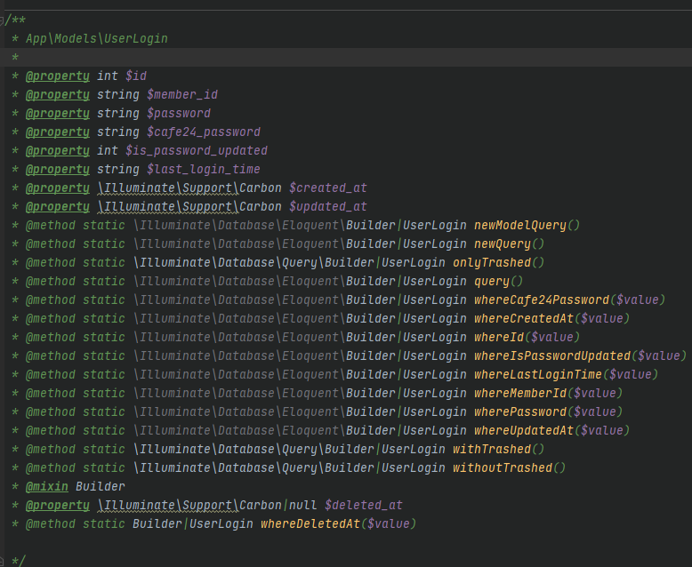

##Laravel IDE Helper Generator
***
기본적으로 PHPStorm에서 Laravel의 Model을 사용해보면 존재하지 않는 Property이기에 PHPStorm에서 자동완성도 지원이 안되고  
심지어 Laravel의 Model Method들 조차 자동완성이 지원이 되지를 않는다.  
역시 같은 고민을 많이들 해서 그런지 해결책이 존재하였다. (물론 손수 PHPDoc으로 써줘도 된다.)

> https://github.com/barryvdh/laravel-ide-helper  
> Laravel IDE Helper Generator

```
composer require --dev barryvdh/laravel-ide-helper
```

Composer로 설치를 하고

```
php artisan ide-helper:models
```

artisan 명령어를 실행해보면 Models 폴더내에 존재하는 Model 클래스를 상속받는 모든 클래스의 PHPDoc을 자동으로 작성해준다.

  
빌더도 사용가능하고 해당 DB에 직접 접속해서 해당 테이블의 칼럼 정보까지 전부 자동으로 집어넣어준다.  
그리고 맞지 않는 일부 정보만 다듬어주면 된다.