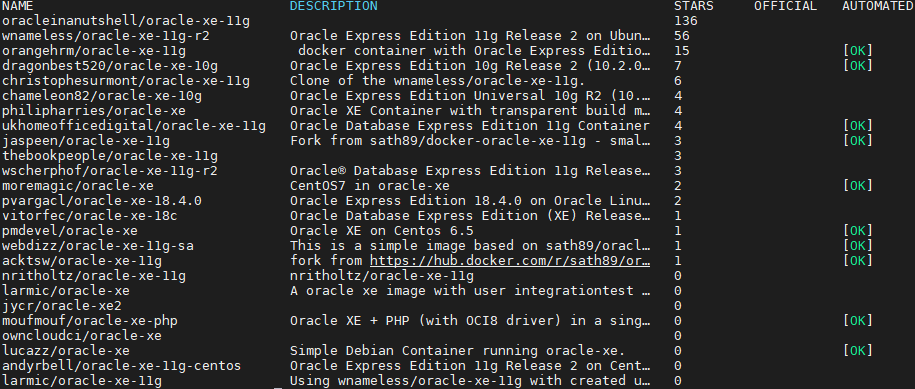
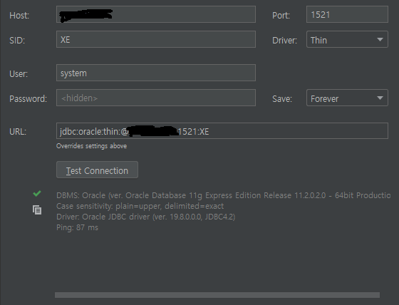

# Docker로 Oracle XE 설치
***
Ubuntu Server 환경에서 Oracle XE를 설치하려니 RedHat 기반이라 패키지부터 Debian용으로 바꾸는 것부터 별별 설정을 해야하는 등  
삽질만 하다 실패해서 그냥 간단하게 Docker로 설치해보기로 했다.  
생각해보면 Docker로 CentOS 깔아서 그 위에 Oracle XE를 설치하는 방법도 있겠으나 삽질의 여파로 그것조차 귀찮아지기 시작했다.
***
## 1. 이미지 설치
***
먼저 Docker 이미지를 찾아보자
```
docker search oracle-xe
```
  

Star가 가장 많은 걸 믿어보기로 한다.

```
docker pull oracleinanutshell/oracle-xe-11g
```

## 2. 컨테이너 실행 
***
이제 컨테이너를 실행해보자.

```
// 외부접속 허용
// 포트는 1521로 지정
docker run -d -p 1521:1521 -e ORACLE_ALLOW_REMOTE=true oracleinanutshell/oracle-xe-11g
```

> https://hub.docker.com/r/oracleinanutshell/oracle-xe-11g  
> 이외의 옵션은 페이지를 참고해보자 (실은 별거 없다.)

기본 접속 정보는
```
sid: xe
username: system
password: oracle
```  

DataGrip으로 붙어보니 잘 된다.

