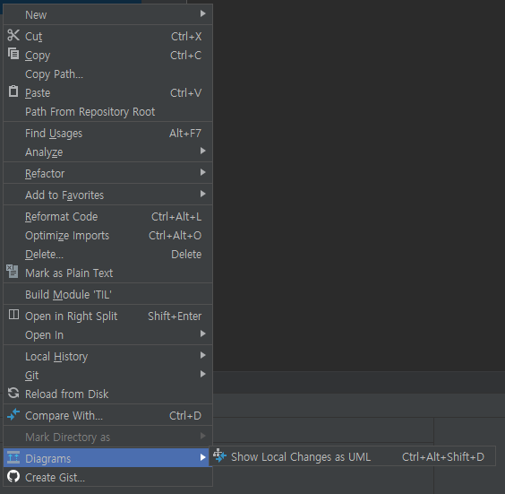
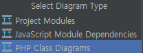
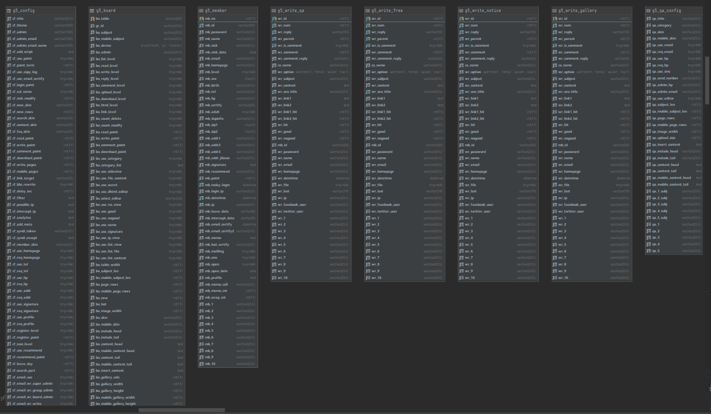

## DataGrip Diagram
> IntelliJ Ultimate는 Datagrip을 포함하고 있기때문에 당연히 된다.

IntelliJ에서 파일에 우측버튼을 눌러보면 Diagrams가 있는데 이게 여러가지 기능을 해준다.

---

폴더, 프로젝트 단위를 선택해주면 이렇게 클래스 다이어그램을 그려준다던가..

그 중에서도 데이터베이스에 대고 Visualisation을 선택하면..

이렇게 테이블 구조도를 그려준다.
> 설정이 하나도 안된 테이블이라 그렇지  
> 외래키를 지정하거나 테이블 이름 + _id 의 형식의 칼럼은 자동으로 참조관계로 인식해서  
> 참조관계라는걸 나타내준다.